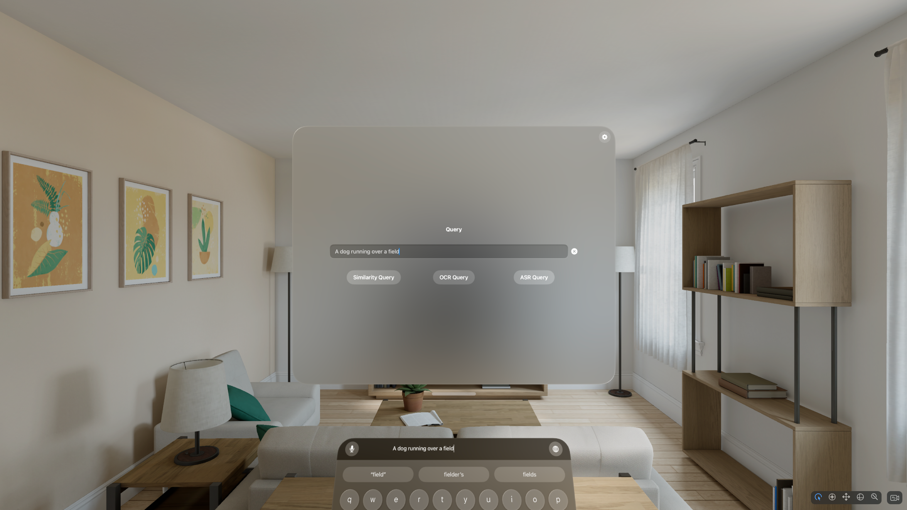
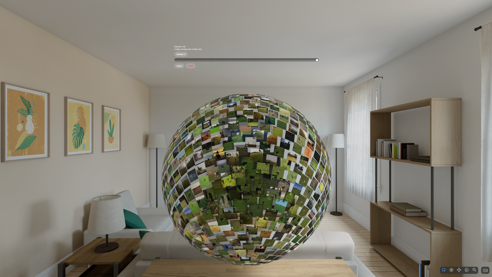

# MediaMix

<p align="center">
  
</p>

MediaMix is an immersive multimedia retrieval system for **visionOS** that enables querying, exploration, and visualization of large-scale multimedia collections in **mixed reality (MR)**.

The project focuses on combining multimodal retrieval with spatial result exploration. It supports multiple retrieval backends and provides both conventional 2D and immersive 3D interfaces. MediaMix is primarily intended as a research and experimentation platform.

---

## Table of Contents

* [Overview](#overview)
* [Features](#features)
* [Screenshots](#screenshots)
* [Architecture](#architecture)
* [Retrieval Backends](#retrieval-backends)
* [Getting Started](#getting-started)
* [Configuration](#configuration)
* [Publications](#publications)
* [License](#license)

---

## Overview

MediaMix enables users to perform multimedia retrieval using text, speech, and visual cues. Search results can be explored either in a classic grid-based interface or in immersive spatial layouts that leverage mixed reality.

The system is designed to be modular and extensible. Retrieval engines, query types, and result visualizations are decoupled, making it straightforward to integrate additional backends or interaction techniques.

---

## Features

### Query Modalities

* Text-based similarity search
* OCR-based queries on visual content
* ASR-based speech queries
* Example-based similarity search

### Result Exploration

* 2D grid-based result visualization
* 3D spherical layouts for immersive exploration
* Segment-level video playback and interaction

### Retrieval and Evaluation

* Runtime-switchable retrieval backends
* Dataset-specific filtering (e.g., LHE categories)
* Integrated [DRES](https://github.com/dres-dev/DRES)-compatible submission workflow

### Software Design

* Modular, feature-oriented architecture
* Clear separation of UI, domain logic, and services
* Backend-agnostic retrieval abstractions

---

## Screenshots

### Query Interface



### Immersive Sphere Visualization



### Grid-Based Result View


---

## Architecture

The project follows a layered and feature-oriented architecture. Core retrieval logic is isolated from user interface components, and retrieval engines are accessed through a common abstraction layer.

```text
MediaMix/
├── App/                 App entry point and global state
├── Domain/              Core models and retrieval abstractions
├── QueryWindow/         Query UI and view models
├── ResultDisplay/       Result visualization components
│   ├── Grid/            Grid-based result views
│   ├── SegmentViewer/   Temporal / segment-based views
│   └── Spheres/         3D sphere-based exploration
├── Services/            Retrieval engines and integrations
│   └── Retrieval/       Backend retrieval logic
├── Settings/            Configuration and settings UI
├── Submission/          DRES submission support
├── Utilities/           Shared helpers and extensions
└── Packages/
    └── RealityKitContent/  RealityKit assets and components
```

---

## Retrieval Backends

MediaMix currently supports the following retrieval engines:

* **FereLight**
  High-performance multimedia retrieval backend
  [https://github.com/FEREorg/ferelight](https://github.com/FEREorg/ferelight)

* **vitrivr**
  Open-source multimedia retrieval engine with multimodal support
  [https://github.com/vitrivr/vitrivr-engine](https://github.com/vitrivr/vitrivr-engine)

Backends can be selected and configured at runtime via the application settings.

---

## Getting Started

### Prerequisites

* macOS Sonoma or newer
* Xcode 15 or newer
* visionOS SDK

### Build Instructions

1. Clone the repository:

   ```bash
   git clone https://github.com/rahelarnold98/MediaMix.git
   ```
2. Open `MediaMix.xcodeproj` in Xcode
3. Configure the retrieval backend in `config.json`
4. Select a visionOS simulator or supported device
5. Build and run the project

---

## Configuration

The application is configured via a JSON-based configuration file.

Key configuration options include:

* Active retrieval backend
* Backend endpoint and credentials
* Dataset-specific parameters and filters

Refer to `example.config.json` for available options and example values.

---

## Publications

If you use MediaMix in academic work, please cite the following publications.

**MediaMix: Multimedia Retrieval in Mixed Reality**
Rahel Arnold, Rahel Kempf, Raphael Waltenspül, and Heiko Schuldt.
Proceedings of the 31st International Conference on Multimedia Modeling (MMM 2025).
[https://doi.org/10.1007/978-981-96-2074-6_37](https://doi.org/10.1007/978-981-96-2074-6_37)

**MediaMix: Multimedia Retrieval with Dual Backend Support and Result Exploration in MR**
Rahel Arnold, Anna Pietzak, and Heiko Schuldt.
Proceedings of the 32nd International Conference on Multimedia Modeling (MMM 2026).
[https://doi.org/10.1007/978-981-95-6963-2_22](https://doi.org/10.1007/978-981-95-6963-2_22)

---

## License

This project is released under the **MIT License**.
See the `LICENSE` file for details.
